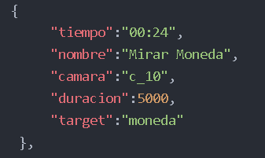

# EVEN - Entorno Virtual Explicativo Narrativo

## Introducción&#x20;

Even es una herramienta desarrollada para generar un recorrido guiado de un objeto/escenario tridimensional.

El recorrido cuenta con **puntos de interés** predeterminados mediante un **guión** que son dispuestos a lo largo de un archivo de audio. Destaca como principal recurso interactivo que los usuarios pueden navegar por el espacio virtual con libertad. A diferencia de otros visualizadores 3D, Even permite narrar un relato lineal, y visualizar diferentes puntos de vista de un mismo modelo 3D en 360°.

<figure><figcaption></figcaption></figure>

## Elementos

### Audio

La guía explicativa que acompaña al modelo

### Escena

El modelo es la estructura o espacio del cual se está hablando.

### Guión

El programa que controla el vínculo y la sincronización entre los movimientos de la cámara y el audio.

<figure><figcaption></figcaption></figure>

## Usos de la herramienta

1. Generar recorridos virtuales.
2. Determinar una duración para el recorrido (mediada por un archivo de audio).
3. Cargar y escuchar pistas de audio (puede ser música o un archivo hablado).
4. Explorar nuevas formas de acercamiento al mundo tridimensional.
5. Innovar en la transmisión de producción multimedial

## Ver en formato presentación


