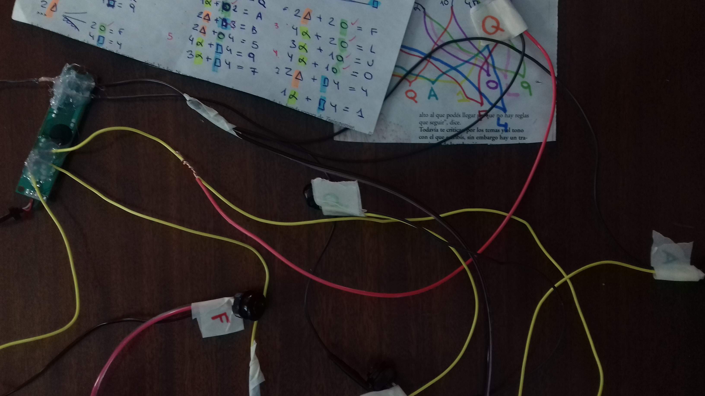
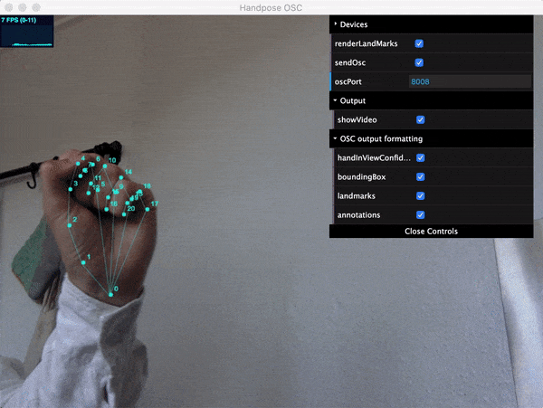
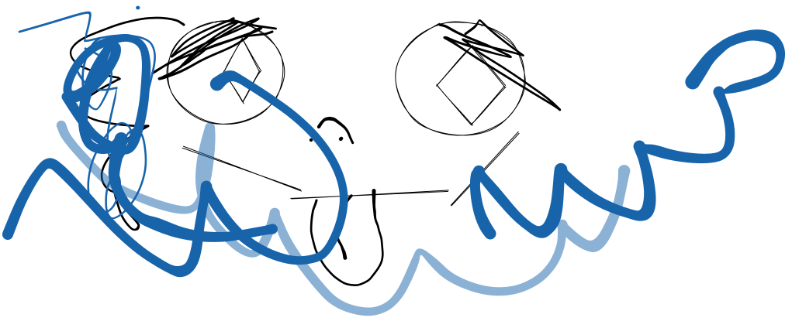

# bloques

esto es un parrafo

## aca esta es mi edición 1

### esto es el heading 2

#### esto es el heading 3

* esto es
* una lista
* desordenada

1. esto
2. es una lista
3. OR DE NA DA

* [ ] una lista de tareas
* [ ] bueno necesita 2 para ser lista


pista! buena



pista neutra



pista preocupante!



DANGER! DANGER! DANGER!


> "una cita (no de salir, sino de texto)"

```
// Some code
println("hola emmelabers");
```


así estoy probando subir un gif


<figure><figcaption><p>probando subir una imagen</p></figcaption></figure>

<figure><figcaption></figcaption></figure>


probando insertar media


| tabla                 | esto es una tabla |   |
| --------------------- | ----------------: | - |
| y estos son sus items |                   |   |
|                       |             holis |   |
|                       |                   |   |
|                       |                   |   |



holis



chau&#x20;

acá se puede isertar cualqueir cosa tmb



<details>

<summary>TOGGLES</summary>

los toggles son excelentes

también se puede poner cualqueir cosa acá

como todo el guión de shrek

</details>




$$
f(x) = x * e^{2 pi i \xi x}
$$

Formulas matemáticas con Tex, nice&#x20;



aca debería poner un comando







```javascript
{
    // Response
}
```





